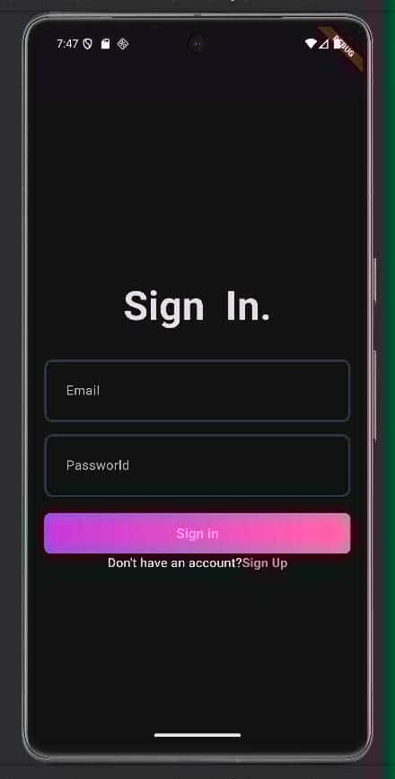
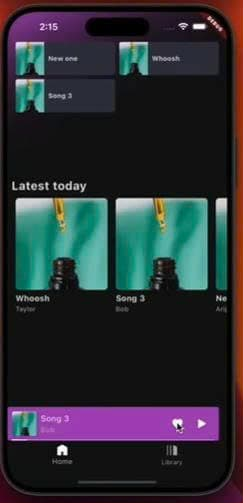
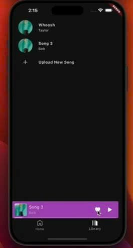
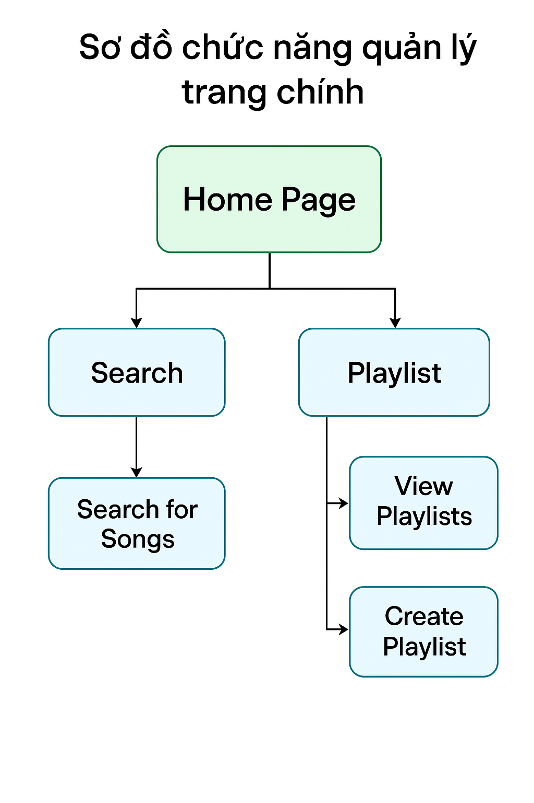
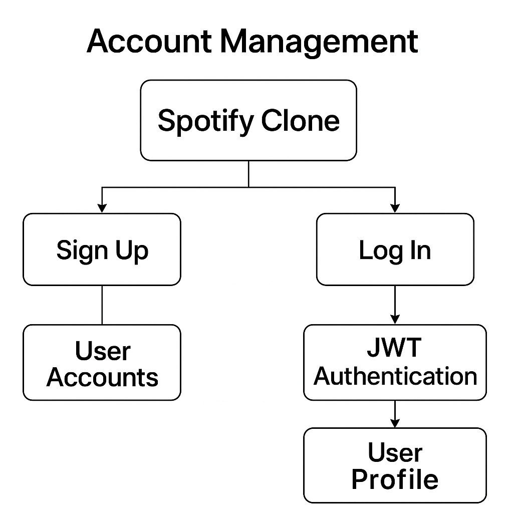

# 🎧 BÁO CÁO DỰ ÁN: SPOTIFY CLONE

## 📌 Đề tài: Xây dựng ứng dụng nghe nhạc Spotify Clone

##  👨‍💻 NHÓM THỰC HÀNH : NHÓM 9

## 🎓 GV : Trương Anh Hoàng 

### 👥 Thành viên nhóm

- **👨‍💻 Thành viên 1:**  
  - Họ và tên: Lê Đức Vũ  
  - MSSV: 23010608

- **👨‍💻 Thành viên 2:**  
  - Họ và tên: Đỗ Bảo Long  
  - MSSV: 23010561

---

## 📚 MỤC LỤC

- [🎯 I. Mục tiêu và lý do chọn đề tài](#🎯-i-mục-tiêu-và-lý-do-chọn-đề-tài)
- [🧰 II. Công nghệ sử dụng](#🧰-ii-công-nghệ-sử-dụng)
- [🏗️ III. Thiết kế hệ thống](#🏗️-iii-kiến-trúc-hệ-thống)
- [✅ IV. Tính năng chính đã triển khai](#✅-iv-tính-năng-chính-đã-triển-khai)
- [🧪 V. Kết quả đạt được](#🧪-v-kết-quả-đạt-được)
- [⚠️ VI. Hạn chế & Hướng phát triển](#⚠️-vi-hạn-chế--hướng-phát-triển)
- [📚 VII. Tài liệu tham khảo](#📚-vii-tài-liệu-tham-khảo)
- [📝 VIII. Tổng kết](#📝-viii-tổng-kết)

---

## 🎯 I. Mục tiêu và lý do chọn đề tài

- Ngày nay, các nền tảng phát nhạc trực tuyến đóng vai trò quan trọng trong đời sống giải trí số, đặc biệt là Spotify.  
  Việc xây dựng ứng dụng Spotify Clone giúp chúng em:
  - Tiếp cận thực tế kiến trúc và tính năng của hệ thống hiện đại
  - Rèn luyện kỹ năng lập trình **frontend** và **backend**
  - Hiểu rõ mô hình kiến trúc **MVVM**

- ⚙️ **Kiến trúc MVVM**:  
  Giúp tách biệt rõ ràng giữa giao diện và logic, tăng tính bảo trì và mở rộng.

- 🧩 **Frontend**:  
  - Dùng **Flutter** kết hợp **Riverpod** để quản lý trạng thái và logic ứng dụng.

- 🛠 **Backend**:  
  - Dùng **FastAPI** để xây dựng RESTful API hiệu suất cao, hỗ trợ xác thực và streaming nhạc.

- 🔑 **Tính năng chính**:
  - Đăng nhập bảo mật bằng JWT
  - Phát nhạc trực tuyến
  - Quản lý playlist cá nhân
  - Upload và phát file MP3

---

## 🎯 Mục tiêu đề tài

- 🎨 Thiết kế giao diện người dùng đẹp, trực quan (UI mô phỏng Spotify)
- 🧱 Xây dựng kiến trúc MVVM
- 📱 Sử dụng Flutter + Riverpod cho frontend mobile
- 🔙 Xây dựng API backend bằng FastAPI
- 🔒 Áp dụng JWT, phát nhạc (streaming), upload MP3, playlist,...

---

## 🧰 II. Công nghệ sử dụng

### 📲 Frontend - *Flutter*
- ⚙️ `Flutter 3.19.5`: Framework đa nền tảng
- 🧠 `Riverpod 2.5`: Quản lý trạng thái
- 🌐 `Dio`: Gửi request HTTP
- 🔀 `GoRouter`: Điều hướng
- 🎵 `AudioPlayers`: Phát nhạc
- 🖼 `CachedNetworkImage`: Tối ưu ảnh

### 🖥️ Backend - *FastAPI*
- ⚡ `FastAPI`: Framework tốc độ cao
- 🧪 `Pydantic`: Kiểm tra dữ liệu đầu vào
- 🗃️ `SQLAlchemy`: ORM cho DB
- 🧱 `SQLite`: Cơ sở dữ liệu nhẹ
- 🔐 `JWT`: Đăng nhập và bảo mật

---

## 🏗️ III.Thiết kế hệ thống

### 1. Tổng quan thiết kế

- Hệ thống được xây dựng theo kiến trúc **Client-Server**, trong đó:
  - **Frontend** (Flutter) gửi yêu cầu và nhận dữ liệu từ **Backend** (FastAPI) thông qua RESTful API.
  - Mô hình **MVVM** được áp dụng ở frontend để tách biệt rõ ràng giữa giao diện (View), logic xử lý dữ liệu (ViewModel) và dữ liệu (Model).
  - Backend chịu trách nhiệm xử lý xác thực, quản lý dữ liệu người dùng, bài hát, playlist và streaming nhạc.

### 2. Thiết kế cơ sở dữ liệu

- Sử dụng **SQLite** làm cơ sở dữ liệu nhẹ, thuận tiện cho phát triển và thử nghiệm.
- Các bảng chính:
  - **User**: lưu thông tin người dùng như id, email, mật khẩu đã mã hóa, tên...
  - **Song**: lưu thông tin bài hát như id, tên bài hát, tác giả, đường dẫn file nhạc...
  - **Playlist**: chứa thông tin playlist như id, tên playlist, người tạo playlist...
  - **PlaylistSong**: bảng trung gian quản lý quan hệ nhiều-nhiều giữa Playlist và Song.

### 3. Mô hình dữ liệu (ER Diagram)
- Một người dùng có thể tạo nhiều playlist.
- Một playlist có thể chứa nhiều bài hát.
- Một bài hát có thể nằm trong nhiều playlist.

### 4. Thiết kế API

| Endpoint          | Phương thức  | Mục đích                         | Yêu cầu xác thực JWT |
|-------------------|--------------|---------------------------------|---------------------|
| `/auth/register`  | POST         | Đăng ký tài khoản                | Không               |
| `/auth/login`     | POST         | Đăng nhập, trả về JWT token     | Không               |
| `/songs`          | GET          | Lấy danh sách bài hát           | Có                  |
| `/songs/{id}`     | GET          | Lấy chi tiết bài hát            | Có                  |
| `/playlists`      | GET / POST   | Lấy danh sách hoặc tạo playlist | Có                  |
| `/playlists/{id}` | GET / PUT / DELETE | Quản lý playlist            | Có                  |
| `/upload`         | POST         | Upload file nhạc mới            | Có                  |
| `/stream/{id}`    | GET          | Streaming bài hát               | Có                  |

### 5. Quy trình xử lý đăng nhập (Authentication Flow)

1. Người dùng gửi thông tin đăng nhập (email và mật khẩu).
2. Backend xác thực thông tin và tạo JWT token nếu hợp lệ.
3. Token được trả về client, lưu giữ để sử dụng trong các request sau.
4. Backend kiểm tra token JWT ở các API yêu cầu xác thực trước khi cho phép truy cập.

### 6. Streaming nhạc

- Backend sử dụng `StreamingResponse` của FastAPI để gửi dữ liệu âm thanh dạng luồng.
- Frontend nhận dữ liệu stream và phát nhạc trực tiếp, hỗ trợ các thao tác tua, dừng/phát bài hát.

---

## ✅ IV. Tính năng chính đã triển khai

### 🔐 1. Đăng ký & Đăng nhập (JWT Authentication)

- Người dùng tạo tài khoản, đăng nhập.
- Hệ thống cấp JWT token lưu ở localStorage/client để gửi kèm mỗi lần request.
- Backend xác thực token, cho phép truy cập tài nguyên cá nhân (playlist, upload,...).

**Ảnh minh họa:**  


**Ảnh minh họa**


---

### 🎧 2. Trình phát nhạc (Streaming MP3)

- Giao diện phát nhạc giống Spotify.
- Streaming từ API backend (phản hồi qua `StreamingResponse`)
- Có thể tua, dừng/phát, chuyển bài.

**Ảnh minh họa:**  


---

### 🔍 3. Tìm kiếm và danh sách bài hát

- Danh sách bài hát hiển thị dưới dạng scrollable grid.
- Cho phép tìm kiếm theo tên bài hát.

**Ảnh minh họa:**  


---

### 📂 4. Playlist cá nhân

- Người dùng tạo nhiều playlist.
- Thêm/xóa bài hát vào playlist.
- Dữ liệu playlist gắn với tài khoản người dùng trong CSDL.

**Ảnh minh họa:**  


### 📑 5. Sơ đồ chức năng quản lí trang chính:


### 📈 6. Sơ đồ quản lí tài khoản:


---

## 🧪 V. Kết quả đạt được

- ✅ Giao diện mô phỏng Spotify (UI đẹp, responsive)
- ✅ Backend phản hồi nhanh, dùng JWT bảo mật
- ✅ Chức năng phát nhạc, quản lý playlist ổn định
- ✅ Swagger UI demo API

📷 **Một số giao diện**:
- Trang Home
- Player
- Playlist cá nhân

---

## ⚠️ VI. Hạn chế & Hướng phát triển

### ❌ Hạn chế:
- Chưa có tính năng nghe offline
- Chưa hỗ trợ bình luận, chia sẻ
- Bảo mật JWT chưa có refresh token, rate limiting

### 🚀 Hướng phát triển:
- Tích hợp Firebase (auth + storage)
- Tính năng like, comment, gợi ý nhạc
- Phát nhạc nền (background playback)
- Hỗ trợ Web/Desktop với Flutter

---

## 🧾 VII. Kết luận

Đề tài **Spotify Clone bằng Flutter + FastAPI** giúp nhóm em:
- Nắm chắc quy trình xây dựng hệ thống full-stack
- Hiểu rõ các công nghệ như JWT, REST API, MVVM
- Có khả năng mở rộng thành app thực tế

Xin chân thành cảm ơn thầy/cô đã hướng dẫn, góp ý để nhóm hoàn thành đồ án này.

---
## 📝 VIII. Tổng kết

Qua quá trình thực hiện dự án, nhóm đã hoàn thành các mục tiêu đề ra, bao gồm thiết kế giao diện, xây dựng backend, phát triển tính năng streaming và quản lý playlist. Dự án giúp nhóm nâng cao kỹ năng lập trình đa nền tảng, hiểu sâu về kiến trúc MVVM và bảo mật JWT. Tuy còn một số hạn chế, nhóm sẽ tiếp tục hoàn thiện và mở rộng trong tương lai.

Xin chân thành cảm ơn thầy cô và các bạn đã hỗ trợ nhóm trong suốt quá trình thực hiện đề tài.

## 📚 Tài liệu tham khảo
- [Flutter.dev](https://flutter.dev)
- [FastAPI Docs](https://fastapi.tiangolo.com)
- [Riverpod.dev](https://riverpod.dev)
- [AudioPlayers Plugin](https://pub.dev/packages/audioplayers)
- [YouTube Tutorial](https://www.youtube.com/watch?v=9gpAtzQhYkY&t=17418s)
## 🚀 Cách chạy dự án Flutter

### 1. Clone và cài đặt 📥

```bash
Clone:
git clone https://github.com/leducvu192005/leducvu192005.git
cd leducvu192005
```
```bash
Cài đặt:
flutter run
```

### 2. Push on Github:

```bash
git init 
```
```bash
git pull origin main
```
```bash
git status
```
```bash
git add .
```
```bash
git commit -m "Tên commit"
```
```bash
git push origin main
```
